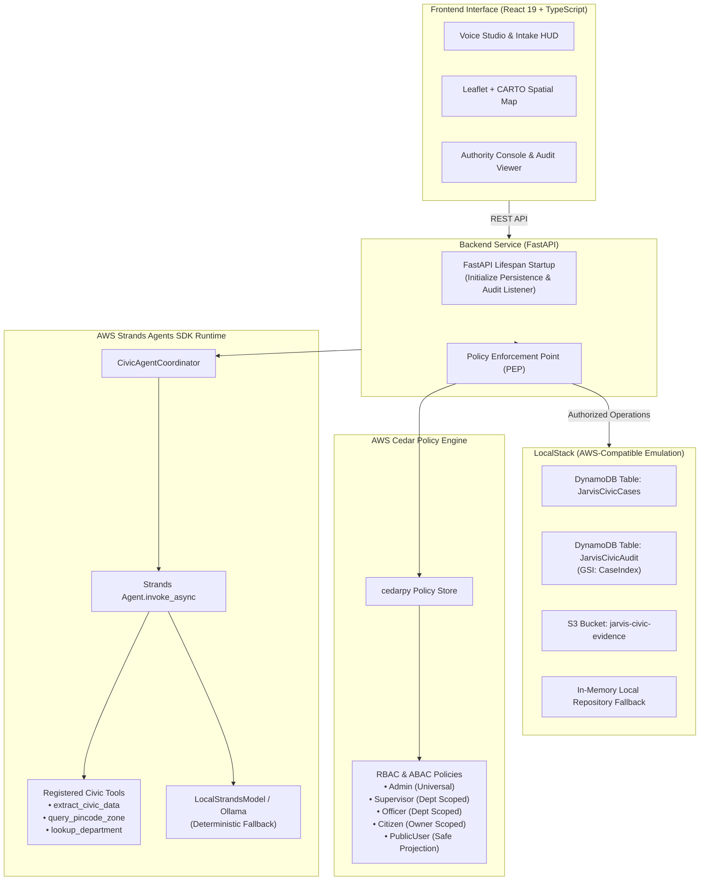

# 🏛️ JARVIS Civic

## Speak. Report. Resolve.

### AI-Assisted Civic Decision-Support & Structured Grievance Routing Engine

"One conversation → one structured civic action docket."

[](https://github.com/awslabs/strands-agents)
[](https://www.cedarpolicy.com/)
[](https://localstack.cloud/)
[](https://fastapi.tiangolo.com/)
[](https://react.dev/)
[](#verification-matrix)
[](#verification-matrix)
[](#verification-matrix)

---

## Product Overview

> Citizens describe problems in human language.<br>
> JARVIS Civic turns those conversations into structured civic intelligence.

```
SPEAK
  ↓
UNDERSTAND
  ↓
LOCATE
  ↓
CLASSIFY
  ↓
ROUTE
  ↓
STRUCTURE
  ↓
TRACK
  ↓
EVIDENCE
```

JARVIS Civic is an AI-assisted civic decision-support and workflow prototype that transforms natural-language citizen communication into structured, evidence-aware, trackable Civic Action Dockets.

### The System Invariant

* **AI reasons.**
* **Deterministic systems validate.**
* **Cedar authorizes.**
* **The workflow engine controls transitions.**
* **Persistence stores the record.**
* **Audit records the action.**

---

## Problem

Civic complaints frequently arrive as:
* Spoken telephone calls and voice notes
* Multilingual natural-language chat messages
* Incomplete descriptions missing actionable details
* Ambiguous locations without geographical context or landmarks
* Missing photographic or acoustic evidence
* Unclear department categorization leading to jurisdictional ping-pong

**The core problem:** Unstructured citizen communication does not map cleanly to structured civic workflows.

---

## Solution

JARVIS Civic serves as the structured intelligence layer between raw citizen communication and a potential civic workflow:

* **Conversational Intake:** Voice and text processing in citizen vernacular.
* **Civic Intent Extraction:** Automatic identification of civic defects from natural language.
* **Missing-Information Detection:** Dynamic prompts requesting missing parameters (landmarks, pin codes) before docket creation.
* **Location Capture:** Explicit capture of textual references and citizen-selected map coordinates.
* **Department Recommendation:** Intelligent triage suggesting the responsible municipal jurisdiction.
* **Urgency Assessment:** Objective risk evaluation based on severity and public safety factors.
* **Structured Civic Action Docket:** A normalized, canonical digital record ready for review.
* **Evidence Handling:** Secure validation and storage of photographic and audio documentation.
* **Workflow Tracking:** End-to-end lifecycle visibility for citizens and authority reviewers.
* **Cedar-Governed Authorization:** Fine-grained role-based policy enforcement.
* **Auditability:** Complete, append-only operational trail recording every authorization decision.

> The system generates an AI-generated civic grievance record. It does not claim official government submission or resolution.

---

## The Core Idea

### AI reasoning does not equal authority.

An LLM can suggest:
> *"This appears to be a drainage blockage near Thousand Lights metro."*

However, in JARVIS Civic, probabilistic model suggestions never make authoritative decisions. Deterministic application and security layers decide:

* **Is the intent in the controlled taxonomy?** Only recognized enum values are accepted.
* **Is the pincode structurally valid?** Validated by regex and municipal zone datasets.
* **Is the department recognized?** Mapped to verified routing classifications.
* **Is the actor authorized?** Evaluated strictly by the AWS Cedar Policy Enforcement Point.
* **Is the workflow transition legal?** Enforced by an optimistic state machine allowing only single-stage forward steps.
* **Is the uploaded file actually the claimed type?** Verified via server-side binary magic-byte signatures.
* **Which fields are safe to expose publicly?** Filtered through a redacted projection model.

---

## How It Works

```
Citizen Communication (Voice / Text)
        ↓
AWS Strands Agents SDK Runtime (Intake Turn)
        ↓
Registered Civic Tools Execution
  ├── extract_civic_data
  ├── query_pincode_zone
  └── lookup_department_jurisdiction
        ↓
Local LLM Provider (Ollama / LocalStrandsModel with Deterministic Fallback)
        ↓
Canonical Pydantic State Normalization (CanonicalCivicState)
        ↓
Citizen Review & Location Confirmation
        ↓
Docket Generation (POST /api/cases)
        ↓
AWS Cedar Policy Enforcement Point (PEP) Authorization
        ↓
Persistence Backend (LocalStack DynamoDB & S3 / In-Memory Fallback)
        ↓
Immutable Audit Dispatcher
        ↓
Public-Safe Tracking & Authority Workflow Console
```

---

## Why JARVIS Civic Is an Agent System

JARVIS Civic does not rely on a single monolithic prompt. It orchestrates specialized reasoning agents using the **AWS Strands Agents SDK**:

```
Citizen Message
        ↓
CivicAgentCoordinator
        ↓
Strands Agent Runtime (Agent.invoke_async)
        ↓
Registered Civic Tools
  ├── extract_civic_data
  ├── query_pincode_zone
  └── lookup_department_jurisdiction
        ↓
Clarification / Multi-Turn Enrichment
        ↓
Canonical Civic State
        ↓
Deterministic Validation
        ↓
Cedar Authorization
        ↓
Civic Action Docket
```

* **Coordination Layer:** `CivicAgentCoordinator` executes multi-turn conversational intake using `Agent.invoke_async`.
* **Agent Tooling:** Strands tools inspect municipal boundaries, postal codes, and department matrices.
* **Local Provider Integration:** Uses `LocalStrandsModel` interfacing with a local Ollama daemon, with automated deterministic fallback if the model daemon is unreachable.
* **Controlled Scope:** The agent assists in extraction, normalization, and clarification; it does not take autonomous actions against real-world systems.

---

## Trust Model

### Probabilistic reasoning. Deterministic enforcement.

```
AI / PROBABILISTIC
        ↓
Intent Analysis + Civic Extraction + Urgency Assessment
        ↓
Canonical Civic State Proposal
        ↓
DETERMINISTIC
        ↓
Pydantic Schema & Enum Validation
        ↓
Cedar Policy Engine Authorization (PEP)
        ↓
Lifecycle State Machine Transitions
        ↓
Durable Persistence (DynamoDB / Local Repository)
        ↓
Authoritative Append-Only Audit Trail
```

---

## Product Experience

The frontend is organized into four purpose-built studios:

### Page 01: Product Experience
* **Corridor Simulation:** Interactive GIS geospatial exploration of urban transit hubs.
* **Sample Civic Signals:** Clearly demarcated product visualization markers labeled `SAMPLE CIVIC SIGNAL // PRODUCT VISUALIZATION`.
* **Multilingual Interaction:** Live vernacular benchmarks showcasing real-time extraction across 8 Indian languages.
* **Telemetry & Transformation:** Visual comparison of raw citizen text against canonical Pydantic parameters.

### Page 02: Report Civic Issue
* **Voice Studio:** Hands-free speech-to-text recording with dynamic audio wave visualization and keyboard controls (`Space` to record, `Esc` to cancel).
* **Live Civic Extraction HUD:** Real-time progressive field indicators detecting issue category, location reference, recommended department, and objective urgency.
* **Clarification Engine:** Prompts for missing information before enabling docket creation.
* **Interactive Map Pinning:** Allows citizens to pinpoint exact map coordinates with street-level accuracy.
* **Action Docket Modal:** Review dialog providing transparency before generating the docket record.

### Page 03: Track Docket & Authority Console
* **Public-Safe Tracking:** Redacted milestone timeline accessible without authentication.
* **Authority Workflow Console:** Role-simulated municipal workspace for authorized officers and supervisors to review cases, attach timestamped resolution notes, and advance status.
* **Canonical 5-Stage Lifecycle:**
```
01 DOCKET CREATED → 02 ROUTING PREPARED → 03 SUBMISSION READY → 04 UNDER REVIEW → 05 RESOLVED
```
* **Cedar-Governed Audit Trail:** Append-only timeline displaying event IDs, principal roles, Cedar authorization decisions, and evaluation diagnostics.

### Page 04: Evidence Studio
* **Evidence Ingestion:** Drag-and-drop file uploader supporting photographic, audio, and textual civic documentation.
* **Server-Side Validation:** Rigorous binary magic-byte inspection protecting storage from malicious or renamed files.
* **Secure Case Association:** Attaches evidence to dockets under server-generated, sanitized storage keys.

---

## AWS Architecture



* **AWS Strands Agents:** Powers the multi-agent conversational reasoning loop, tool execution, and stream event processing.
* **AWS Cedar:** Decoupled server-side authorization evaluating principal roles, department jurisdictions, and resource ownership.
* **Amazon DynamoDB (LocalStack):** Durable storage for civic case records and append-only audit event logs, indexed with a secondary `CaseIndex` GSI.
* **Amazon S3 (LocalStack):** Server-scoped, isolated object storage for civic photographic and audio evidence files.
* **LocalStack:** Provides the local AWS-compatible verification environment with zero external cloud dependencies.

> *Note: Verified locally against AWS-compatible LocalStack services. No production AWS cloud deployment is claimed.*

---

## AWS First Commit — Build It Track Alignment

| AWS Technology | JARVIS Civic Implementation |
|---|---|
| **AWS Strands Agents SDK** | Multi-agent reasoning coordinator, tool registry (`extract_civic_data`, `query_pincode_zone`, `lookup_department_jurisdiction`), and streaming event handling. |
| **AWS Cedar Policy Engine** | Formal decoupled authorization via `cedarpy`. A strict PEP evaluates principal roles and department scoping with fail-closed security. |
| **Amazon DynamoDB** | Document store for case records and audit trails, utilizing atomic `list_append` update expressions to prevent concurrent update overwrites. |
| **Amazon S3** | Object store for civic evidence files with sanitized, server-generated keys (`cases/{case_id}/evidence/{evidence_id}/{filename}`). |
| **LocalStack** | Deterministic local integration testbed emulating DynamoDB and S3 for verifiable development. |

> AWS technologies participate directly in the civic workflow's execution path.

---

## Best UI Track Alignment

* **Command-Center Aesthetics:** High-contrast obsidian backgrounds, emerald confirmation glows, amber caution signals, and cyan technical accents.
* **Live Extraction HUD:** Dynamic status badges, progressive checklist ticks, and real-time confidence scores.
* **Vernacular Voice Studio:** Browser-native speech recognition with visual pulse rings, dynamic waveform meters, and tactile text fallback.
* **Dual-Mode GIS Spatial Mapping:** Leaflet integration using CARTO Dark Matter tiles with strict visual mode isolation.
* **Accessibility (WCAG 2.1 AA):** Focus management with visible focus rings, full keyboard navigability, ARIA status regions, and reduced-motion CSS media queries.
* **Zero Bloat:** Built with vanilla CSS tokens and native React 19 components without heavy generic UI libraries.

---

## Security Architecture

| Security Boundary | Enforcement Mechanism |
|---|---|
| **Non-Civic Input** | Deterministic keyword and domain filters short-circuit off-topic messages without hallucinating civic categories. |
| **Model Output** | Canonical Pydantic schema validation restricts all outputs to controlled enums. |
| **Authorization** | AWS Cedar Policy Enforcement Point (PEP) evaluates every state-modifying action. |
| **Public Data Exposure** | Dedicated projection model strips citizen IDs, notes, and exact coordinates. |
| **Evidence Validation** | File signatures inspected server-side via binary magic bytes. |
| **Upload Limits** | Chunked streaming validation enforces a strict 10 MB ceiling. |
| **Location Semantics** | Explicit source tracking distinguishes citizen-selected coordinates from text references. |
| **Workflow State** | Optimistic concurrency locking prevents invalid, out-of-sequence, or backward status jumps. |

> Frontend controls are not trusted for authorization. Simulated authority headers are test and simulation inputs; server-side Cedar remains authoritative.

---

## Evidence Security

```
Upload Stream
      ↓
Chunked Size Validation (<= 10 MB)
      ↓
Extension Allowlist Check (.jpg, .jpeg, .png, .pdf, .wav, .mp3, .txt)
      ↓
Binary Magic-Byte Signature Verification
      ↓
Filename Sanitization (Directory Traversal Prevention)
      ↓
Server-Generated Object Key Creation
      ↓
S3 Evidence Storage (LocalStack / AWS-Compatible)
      ↓
Authoritative Audit Record Dispatch
```

* **Permitted Extensions:** `.jpg`, `.jpeg`, `.png`, `.pdf`, `.wav`, `.mp3`, `.txt`
* **File Size Ceiling:** Maximum 10 MB enforced during streaming.
* **Signature Enforcement:** Strict byte matching (e.g., `FF D8 FF` for JPEG, `89 50 4E 47` for PNG, `%PDF-` for PDF, `RIFF...WAVE` for WAV, `ID3`/sync frame for MP3).

> Deep antivirus/malware sandbox scanning is not implemented.

---

## Location Truthfulness

Location provenance is explicitly tracked across four discrete categories:

* `TEXT_REFERENCE`: Natural-language address provided by citizen (e.g., *"Near Anna Salai metro"*).
* `CITIZEN_SELECTED`: Confirmed geographical coordinates chosen by citizen on the map.
* `CONFIRMED`: Verified location confirmed during municipal review.
* `UNAVAILABLE`: Location details not provided or withheld on unauthenticated queries.

> JARVIS Civic does not invent coordinates when a citizen has not selected a map position. When coordinates are absent, the map displays a neutral text reference without synthetic pins.

---

## Public-Safe Tracking

Unauthenticated citizens tracking a docket receive a strictly redacted projection:

```json
{
  "case_id": "NS-CHN-2026-9E4B",
  "status": "UNDER_REVIEW",
  "recommended_department": "DRAINAGE_STORMWATER",
  "created_at": "2026-09-18T12:00:00Z",
  "updated_at": "2026-09-18T12:30:00Z"
}
```

* **Withheld Fields:** Citizen names, phone numbers, principal IDs, internal department notes, and exact coordinates are omitted from public projections to protect citizen privacy.

---

## Multilingual & Voice Intake

* **Supported Languages:** English, Tamil (தமிழ்), Hindi (हिन्दी), Telugu (తెలుగు), Kannada (ಕನ್ನಡ), Bengali (বাংলা), Marathi (मराठी), and Hinglish.
* **Intake Mechanism:** Browser-native Web Speech API (`webkitSpeechRecognition`) for local audio capture, with immediate text input fallback for unsupported browsers.
* **Normalization:** Multilingual input is processed to extract standardized English-language civic taxonomies while preserving citizen vernacular text in dockets.

---

## Technology Stack

| Layer | Technologies |
|---|---|
| **Frontend Core** | React 19, TypeScript, Vite |
| **UI & Mapping** | Vanilla CSS, Leaflet, CARTO Dark Matter Raster Tiles, Lucide React Icons |
| **Voice & Audio** | Web Speech API, HTML5 Audio API |
| **Frontend Testing** | Vitest, React Testing Library, jsdom |
| **Backend Core** | Python 3.10+, FastAPI, Pydantic v2, Uvicorn |
| **Agent Framework** | AWS Strands Agents SDK, LocalStrandsModel |
| **Local LLM Provider** | Ollama Local Daemon, HTTPX |
| **Authorization** | AWS Cedar Policy Engine (`cedarpy`) |
| **Cloud Emulation** | LocalStack 3.8 (DynamoDB + S3), Boto3 |
| **Backend Testing** | Pytest, Pytest-Asyncio, Pytest-Mock |

---

## Verification Matrix

All capabilities are verified by automated test suites executed against live local dependencies:

| Layer | Test Suite | Result |
|---|---|---:|
| **Backend Core** | `pytest tests` | **163 / 163 PASS** (100%) |
| **AWS Integration** | `pytest tests/test_localstack_integration.py` | **5 / 5 PASS** (100%) |
| **Frontend Core** | `npx vitest run` | **19 / 19 PASS** (100%) |
| **Type Safety** | `npm run typecheck` (`tsc -b`) | **0 ERRORS** (100%) |
| **Production Build** | `npm run build` (`vite build`) | **PASS (3.01s)** |
| **Clean Venv Install** | `pip install -r requirements.txt` in fresh `.venv` | **PASS** |
| **Secret Scan** | Automated scan for API keys and tokens | **0 CREDENTIALS DETECTED** |

---

## What Is Real vs Simulated?

| Capability | Implementation Status |
|---|---|
| **AWS Strands Runtime** | **Real** — Actively invoked on intake turn via `Agent.invoke_async`. |
| **Local LLM Reasoning** | **Real** — Local Ollama provider with deterministic fallback. |
| **Cedar Policy Engine** | **Real** — Formal evaluation via `cedarpy` before state mutation. |
| **DynamoDB Persistence** | **Real** — Verified against live LocalStack DynamoDB container. |
| **S3 Evidence Storage** | **Real** — Verified against live LocalStack S3 bucket. |
| **Case Lifecycle State Machine** | **Real** — 5-stage forward progression with optimistic concurrency. |
| **Audit Persistence** | **Real** — Authoritative listener initialized prior to request routing. |
| **Evidence Magic Bytes** | **Real** — Strict binary header validation for all supported formats. |
| **Voice Intake** | **Real** — Web Speech API with dynamic audio visualization. |
| **Geospatial Mapping** | **Real** — Interactive Leaflet maps with CARTO raster tiles. |
| **Government API Submission** | **Not Integrated** — Prototype generates structured civic records. |
| **Production Identity Provider** | **Not Integrated** — Uses simulated principal identity headers. |
| **Production AWS Deployment** | **Not Claimed** — Runs against local LocalStack emulation. |
| **Deep Malware Scanning** | **Not Implemented** — Enforces extension and magic-byte checks. |

---

## Quick Start

### 1. Clone the Repository
```bash
git clone https://github.com/Arvindkumar006/Jarvis-civic.git
cd Jarvis-civic
```

### 2. Set Up Backend Virtual Environment
```bash
# Create and activate clean virtual environment
python -m venv .venv

# On Windows:
.venv\Scripts\activate
# On macOS/Linux:
source .venv/bin/activate

# Install backend dependencies
cd backend
pip install -r requirements.txt
```

### 3. (Optional) Start LocalStack
To run against live AWS-compatible DynamoDB and S3 services:
```bash
docker run -d --name jarvis-civic-localstack -p 4566:4566 -e SERVICES=dynamodb,s3 localstack/localstack:3.8.1
```
*(If LocalStack is not running, JARVIS Civic automatically uses its built-in in-memory repository).*

### 4. Run Test Suites
```bash
# Run all backend unit, integration, and security tests
python -m pytest tests

# Run live LocalStack integration tests
python -m pytest -v tests/test_localstack_integration.py
```

### 5. Start Backend Server
```bash
python -m uvicorn app.main:app --reload --port 8000
```
* **API Documentation:** [http://127.0.0.1:8000/docs](http://127.0.0.1:8000/docs)
* **Readiness Check:** [http://127.0.0.1:8000/health/ready](http://127.0.0.1:8000/health/ready)

### 6. Start Frontend Application
```bash
cd ../frontend
npm install
npm run typecheck
npx vitest run
npm run dev
```
Open [http://localhost:5173](http://localhost:5173) in your browser.

---

## Repository Structure

```
JARVIS CIVIC/
├── docker-compose.yml              # LocalStack container configuration (DynamoDB + S3)
├── README.md                       # Product documentation and architecture guide
├── backend/
│   ├── requirements.txt            # Bounded Python dependencies (cedarpy, strands-agents)
│   ├── app/
│   │   ├── main.py                 # FastAPI app & lifespan initialization
│   │   ├── agents/                 # Multi-agent coordination (Strands, intent, extraction)
│   │   ├── api/                    # REST API routes (conversation, cases, tracking, audit)
│   │   ├── config/                 # Application settings and environment bounds
│   │   ├── llm/                    # Local Ollama provider and Strands adapter
│   │   ├── models/                 # Pydantic data contracts, enums, security schemas
│   │   ├── security/               # Cedar policy engine service, PEP enforcer, audit models
│   │   └── services/               # Persistence repositories, factory, LocalStack bootstrap
│   └── tests/                      # 163 automated test suites across all layers
└── frontend/
    ├── package.json                # React 19, Vite, TypeScript, Vitest
    ├── src/
    │   ├── App.tsx                 # Main application layout and navigation
    │   ├── components/
    │   │   ├── Conversation/       # Citizen chat intake interface
    │   │   ├── Docket/             # Action Docket generation modal
    │   │   ├── Evidence/           # Evidence Studio drag-and-drop workspace
    │   │   ├── Experience/         # Product Experience & geospatial corridor demo
    │   │   ├── HUD/                # Live Civic Extraction HUD
    │   │   ├── Map/                # Leaflet & CARTO GIS mapping component
    │   │   ├── Tracking/           # Public tracking & Authority Workflow console
    │   │   └── VoiceStudio/        # Multilingual voice recording interface
    │   ├── services/               # Frontend API client and role simulator
    │   ├── types/                  # TypeScript interface contracts matching backend
    │   └── tests/                  # 19 Vitest unit and component tests
```

---

## Intended Impact

* **For Citizens:** Eliminates complex municipal form friction through natural speech intake, transparent tracking, and automated missing-information guidance.
* **For Civic Organizations:** Provides standardized, evidence-backed civic records ready for advocacy and triage.
* **For Future Government Integrations:** Delivers API-ready, normalized data contracts that could ingest cleanly into real municipal ticketing backends.

---

## Limitations

1. **Non-Government Status:** Non-government civic technology prototype.
2. **Session Scope:** Conversation dialogue sessions are held in-process and reset upon process restart; case records and audit logs persist durably.
3. **Simulated Authentication:** Uses simulated principal headers for testing; production OAuth2 / OIDC is not integrated.
4. **Local Verification:** Verified against LocalStack emulation; no live production AWS deployment exists.
5. **No Direct Submission:** Dockets are citizen-side records and are not sent to real municipal servers.
6. **Network Dependencies:** Uses CARTO basemap tiles and Google Fonts when online; graceful fallbacks apply when offline.
7. **No Malware Sandbox:** Relies on strict extension allowlists and binary magic-byte signatures rather than dynamic antivirus sandboxing.

---

## Legal & Ethical Boundary

JARVIS Civic is an independent technology demonstration prototype. Generated dockets are strictly **"AI-generated civic grievance records"**.

The system does not claim:
* Official government submission or filing
* Formal municipal petition acceptance
* Government inspection, dispatch, or field verification
* Statutory legal resolution
* Official municipal jurisdiction assignment

Authority workflow states represent internal application workflow milestones and must not be construed as official government action.

---

## Future Integration Boundary

The structured Civic Action Docket is engineered as a clean boundary for future enterprise extensions:

* **Municipal API Gateways:** Direct dispatch to municipal grievance systems where external APIs exist.
* **Production Identity:** Integration with national identity or OpenID Connect providers.
* **Official Notification Services:** Automated citizen SMS and email status alerts via Amazon SNS/SES.
* **Antivirus Sandboxing:** Deep binary inspection via automated AWS Lambda scanning workflows.
* **Cloud Deployment:** Migration from LocalStack emulation to managed AWS cloud infrastructure.

---

## Repository

* **GitHub Repository:** [https://github.com/Arvindkumar006/Jarvis-civic](https://github.com/Arvindkumar006/Jarvis-civic)
* **License:** Prototype Research & Demonstration License
* **Target Tracks:** AWS First Commit — Build It Track &bull; Best UI Track
