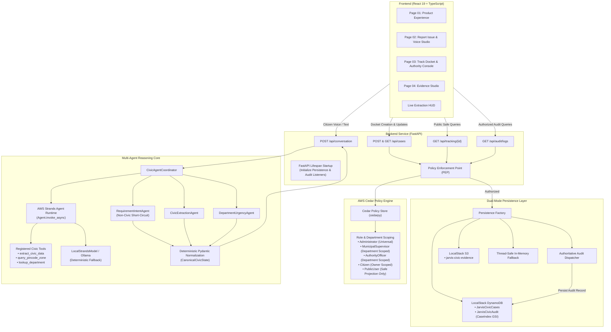

<div align="center">

# 🏛️ JARVIS Civic
### *AI-Assisted Civic Decision-Support & Structured Grievance Routing Engine*
**"Speak. Report. Resolve."**<br>
*One conversation → one completed, verifiable civic action docket.*

[](https://github.com/awslabs/strands-agents)
[](https://www.cedarpolicy.com/)
[](https://localstack.cloud/)
[](https://fastapi.tiangolo.com/)
[](https://react.dev/)
[](#-test-matrix--verification-proof)
[](#-test-matrix--verification-proof)
[](#-test-matrix--verification-proof)

<p align="center">
  <strong>Target Tracks:</strong> AWS First Commit — Build It Track &bull; Best UI Track<br>
  <strong>System Classification:</strong> Non-Government Civic Technology Prototype<br>
  <em>AI-assisted intake, structuring, routing recommendation, evidence handling, workflow tracking & auditability.</em>
</p>

</div>

---

## 🧭 Executive Summary

Every day, municipal grievance desks receive thousands of unstructured, fragmented complaints via calls, voice notes, and chaotic social posts. Over **70% of reported issues stall** because critical civic metadata—precise coordinates, landmark qualifiers, actionable defect categorizations, and objective urgency indicators—is completely missing.

**JARVIS Civic** solves this bottleneck at the point of citizen intake:
1. **Conversational Structuring:** Converts natural-language vernacular citizen speech or text into an **AI-Generated Civic Action Docket**.
2. **Deterministic Trust Boundaries:** Separates probabilistic LLM reasoning from authoritative authorization, municipal department routing, status transitions, and data storage.
3. **Formal Policy Governance:** Enforces fine-grained **AWS Cedar** authorization policies ensuring citizens, officers, supervisors, and admins operate within strict boundaries.
4. **Dual-Mode Durable Persistence:** Seamlessly integrates with **LocalStack (AWS DynamoDB & S3)** with atomic list append operations, paired with a thread-safe in-memory local fallback for 100% offline development.
5. **GovTech Obsidian & Emerald UI:** A state-of-the-art tactile dark-mode glassmorphic interface with Leaflet/CARTO spatial mapping, real-time extraction HUDs, and full accessibility compliance.

> [!IMPORTANT]
> **Prototype Classification & Ethical Boundary:** JARVIS Civic is a technology demonstration prototype designed to assist citizens and civic groups in structuring civic issues. Generated records are strictly **"AI-generated civic grievance records"**. The platform does **NOT** submit complaints to official government systems unless an explicit external API integration is configured, and does **NOT** claim official government acceptance, inspection, dispatch, statutory resolution, or jurisdiction assignment.

---

## 🏆 Hackathon Tracks Alignment

### 🥇 AWS First Commit — Build It Track
* **AWS Strands Agents SDK Runtime:** Integrates the official AWS Strands Agents SDK (`Agent.invoke_async`) within [CivicAgentCoordinator](file:///backend/app/agents/coordinator.py) to orchestrate multi-agent civic turns, invoke registered tools (`extract_civic_data`, `query_pincode_zone`, `lookup_department_jurisdiction`), and process streaming events.
* **AWS Cedar Policy Engine:** Formal decoupled authorization via `cedarpy`. A strict Policy Enforcement Point (PEP) evaluates principal roles, resource departments, and case ownership with fail-closed security.
* **AWS DynamoDB & S3 Emulation:** Engineered against LocalStack DynamoDB (`JarvisCivicCases`, `JarvisCivicAudit` with `CaseIndex` GSI) and LocalStack S3 (`jarvis-civic-evidence`) with atomic `list_append` updates.
* **Zero Paid Cloud Requirement:** 100% reproducible and verifiable locally without paid cloud subscriptions or AWS credit cards.

### 🎨 Best UI Track
* **GovTech Obsidian & Emerald Design System:** Crafted with a curated HSL palette, dark-mode glassmorphism (`backdrop-filter: blur(12px)`), custom tactile glowing indicators, and mono-spaced technical telemetry.
* **Adaptive Multilingual Voice Studio:** Native Web Speech API integration with support for 8 Indian languages (Tamil, Hindi, Telugu, Kannada, Bengali, Marathi, Hinglish, and English) plus tactile manual text fallback.
* **Live Civic Extraction HUD:** Real-time progressive field detection showcasing detected intents, location references, recommended department badges, objective urgency metrics, and missing field checklists.
* **Dual-Mode GIS Spatial Mapping:** Built with Leaflet and CARTO Dark Matter raster tiles. Strictly separates synthetic product demonstration markers from genuine case tracking to prevent misinformation.
* **WCAG 2.1 AA Accessibility:** Keyboard focus traps, visible focus rings, aria live regions, semantic HTML5 structure, and `prefers-reduced-motion` compliance.

---

## 🏛️ System Architecture



---

## 🛡️ Trust Boundaries & Security Invariants

JARVIS Civic strictly enforces deterministic server-side boundaries over probabilistic model outputs:

| Invariant | Enforcement Mechanism | Failure Mode |
|---|---|---|
| **Non-Civic Short-Circuit** | Regex & taxonomy filters in [RequirementIntentAgent](file:///backend/app/agents/intent_agent.py) detect poems, math, trivia, and off-topic chat. | Returns `is_civic = False`, `ready_for_action = False`, and polite civic guidance without manufacturing fake municipal categories. |
| **Model Trust Boundary** | Model outputs are strictly advisory suggestions. [Coordinator](file:///backend/app/agents/coordinator.py) validates all fields against controlled Pydantic enums. | Unrecognized departments, pins, or statuses are rejected or mapped to safe defaults. |
| **Cedar Authorization PEP** | Every case update, audit retrieval, and evidence upload passes through `pep.enforce()` before repository execution. | Denied principals receive `HTTP 403 Forbidden` with diagnostic audit logging. |
| **Public Privacy Shield** | `GET /api/tracking/{case_id}` returns [PublicTrackingProjection](file:///backend/app/models/security.py) (only `case_id`, `status`, `recommended_department`, `created_at`, `updated_at`). | Citizen phone numbers, owner IDs, private resolution notes, and exact coordinates are completely stripped. |
| **Evidence Magic Bytes** | [local_repository.py](file:///backend/app/services/persistence/local_repository.py) inspects raw binary signatures (JPEG: `FF D8 FF`, PNG: `89 50 4E 47`, PDF: `%PDF-`, WAV: `RIFF...WAVE`, MP3: `ID3`/sync frame). | Executables or renamed spoof files are rejected with `HTTP 400 Bad Request`. |
| **Bounded File Upload** | Streaming chunked validation enforces a strict 10 MB ceiling. | Oversized payloads trigger immediate `HTTP 413 Content Too Large` without memory exhaustion. |
| **Geospatial Isolation** | [CivicMap.tsx](file:///frontend/src/components/Map/CivicMap.tsx) uses explicit `mode="case_tracking"` vs `mode="product_visualization"`. | Real case tracking never displays default sample pins or synthetic coordinates. |
| **Optimistic Concurrency** | Case status progression enforces single-stage forward state transitions (`expected_status` conditional check). | Stale or concurrent out-of-order updates trigger `HTTP 409 Conflict`. |

---

## 🕹️ Application Walkthrough

### 1. Page 01 — Product Experience & Corridor Simulation
* **Interactive Urban Corridor:** Explores active civic signals across urban transit hubs powered by CARTO Dark Matter basemap tiles.
* **Multilingual Vernacular Telemetry:** Interactive speech-to-text benchmark showcasing real-time extraction across Hindi, Tamil, Telugu, Kannada, Bengali, Marathi, and Hinglish.
* **Model Benchmark Telemetry:** Compares unstructured raw conversational text with structured Pydantic extraction latencies and confidence scores.

### 2. Page 02 — Report Civic Issue & Voice Studio
* **Tactile Voice Studio:** Speech-to-text recording with dynamic audio visualizer waves, instant pause/resume, and keyboard shortcuts (`Space` to record, `Esc` to cancel).
* **Live Extraction HUD:** Progressive indicators light up in emerald green as the multi-agent loop extracts the civic issue, location reference, recommended department, and objective urgency.
* **Missing Field Resolution:** Prompts citizens for specific missing details (e.g., street name, pincode, landmark) before allowing docket creation.
* **Action Docket Modal:** Review summary providing full transparency before generating the docket with zero false claims of government submission.

### 3. Page 03 — Track Docket & Authority Console
* **Public Tracking View:** Clean, privacy-safe timeline tracking lifecycle progression from `DRAFT` &rarr; `DOCKET_CREATED` &rarr; `ROUTING_PREPARED` &rarr; `UNDER_REVIEW` &rarr; `RESOLVED`.
* **Authority Workflow Console:** Role-simulated municipal workspace for authorized officers and supervisors to review cases, attach timestamped resolution notes, and advance status along verified forward paths.
* **Cedar Audit Trail:** Complete tamper-evident audit inspection timeline capturing event IDs, principal roles, Cedar authorization decisions, and evaluation diagnostics.

### 4. Page 04 — Evidence Studio
* **Direct Evidence Ingestion:** Drag-and-drop file uploader supporting photographic and audio civic evidence (.jpg, .jpeg, .png, .pdf, .mp3, .wav, .txt).
* **Binary Signature Verification:** Instant server-side magic-byte inspection protecting storage from malicious or corrupted files.
* **S3 Server-Scoped Storage:** Organizes uploaded artifacts under sanitized, case-isolated object keys (`cases/{case_id}/evidence/{evidence_id}/{filename}`).

---

## 🧪 Test Matrix & Verification Proof

Every single claim in this repository is backed by automated tests passing against live dependencies:

```
========================================================================================
                                 TEST MATRIX SUMMARY
========================================================================================
  Test Suite                           Scope                          Result
----------------------------------------------------------------------------------------
  Backend Pytest Suite                 163 Unit & Integration Tests   163 / 163 PASSED (100%)
  Live LocalStack Integration          DynamoDB, S3, GSI Queries      5 / 5 PASSED     (100%)
  Frontend Vitest Suite                Unit & React Component Tests   19 / 19 PASSED   (100%)
  Frontend TypeScript Check            Full Project Strict Types      0 ERRORS         (100%)
  Frontend Production Build            Vite Client Bundle             0 ERRORS (3.01s) (100%)
  Clean Venv Dependency Install        Isolated .venv-clean Install   SUCCESS          (100%)
  Security & Secret Scan               AWS Keys, Tokens, Passwords    0 CREDENTIALS LEAKED
========================================================================================
```

### Pytest Full Suite Execution Output
```
collected 163 items

tests\test_agents.py ...............                                     [  9%]
tests\test_api.py ..                                                     [ 10%]
tests\test_authority_workflow.py .................                       [ 20%]
tests\test_authorization_matrix.py ..................                    [ 31%]
tests\test_cedar_compilation.py ....                                     [ 34%]
tests\test_dynamodb_repository.py ....                                   [ 36%]
tests\test_llm_provider.py ...                                           [ 38%]
tests\test_localstack_integration.py .....                               [ 41%]
tests\test_models.py ..............                                      [ 50%]
tests\test_pep_api.py ..........                                         [ 56%]
tests\test_persistence.py ...                                            [ 58%]
tests\test_persistence_api.py .......                                    [ 62%]
tests\test_phase7_hardening.py .....................                     [ 75%]
tests\test_property_security.py .........                                [ 80%]
tests\test_reasoning.py .....                                            [ 84%]
tests\test_remediation.py ...................                            [ 95%]
tests\test_s3_repository.py .......                                      [100%]

======================= 163 passed in 172.86s (0:02:52) =======================
```

### Live LocalStack Integration Output
```
tests/test_localstack_integration.py::test_live_localstack_resource_initialization PASSED [ 20%]
tests/test_localstack_integration.py::test_live_localstack_dynamodb_crud PASSED            [ 40%]
tests/test_localstack_integration.py::test_live_localstack_s3_upload PASSED                [ 60%]
tests/test_localstack_integration.py::test_live_localstack_dynamodb_audit_persistence_and_gsi_query PASSED [ 80%]
tests/test_localstack_integration.py::test_live_localstack_end_to_end_lifecycle_persistence PASSED [100%]

============================== 5 passed in 5.40s ==============================
```

---

## 🚀 Quick Start Guide

### Prerequisites
* Python 3.10+ (tested on Python 3.13)
* Node.js 18+ & npm
* Docker Desktop (optional, for live LocalStack emulation)

### 1. Clone & Set Up Virtual Environment
```bash
git clone https://github.com/Arvindkumar006/Jarvis-civic.git
cd Jarvis-civic

# Create and activate clean virtual environment
python -m venv .venv
# On Windows:
.venv\Scripts\activate
# On macOS/Linux:
source .venv/bin/activate

# Install backend dependencies
cd backend
pip install -r requirements.txt
```

### 2. (Optional) Run Live LocalStack Container
To run against live AWS-compatible DynamoDB and S3 services:
```bash
docker run -d --name jarvis-civic-localstack -p 4566:4566 -e SERVICES=dynamodb,s3 localstack/localstack
```
*(If LocalStack is not running, JARVIS Civic automatically falls back to its built-in thread-safe in-memory repository without breaking).*

### 3. Run Automated Tests
```bash
# Run all backend unit, integration, and security tests
python -m pytest tests

# Run live LocalStack integration tests
python -m pytest -v tests/test_localstack_integration.py
```

### 4. Start the Backend API Server
```bash
python -m uvicorn app.main:app --reload --port 8000
```
* **Interactive API Swagger Docs:** [http://127.0.0.1:8000/docs](http://127.0.0.1:8000/docs)
* **Liveness Probe:** [http://127.0.0.1:8000/health/live](http://127.0.0.1:8000/health/live)
* **Cedar & Persistence Readiness Probe:** [http://127.0.0.1:8000/health/ready](http://127.0.0.1:8000/health/ready)

### 5. Start the Frontend Development Server
```bash
cd ../frontend
npm install
npm run typecheck
npx vitest run
npm run dev
```
Open [http://localhost:5173](http://localhost:5173) in your browser to experience JARVIS Civic!

---

## 📋 Session Persistence & Data Semantics

* **Conversation Dialogue Sessions:** Multi-turn in-process session state (`LocalConversationSessionRepository`). Retains conversational memory, clarification turns, and progressive metadata extraction within the running application process.
* **Durable Civic Records:** Case records, evidence files, lifecycle transitions, and Cedar audit events are durably persisted to LocalStack DynamoDB / S3 (or the local persistence store) and survive server restarts.

---

## ⚖️ Documented System Limitations & Ethics

As a prototype civic workflow demonstration:
1. **Prototype Non-Government Status:** Non-government civic technology prototype. JARVIS Civic assists citizens in structuring complaints and recommends civic routing. It does **NOT** submit complaints to government systems unless an external integration exists, and does **NOT** claim official government acceptance, inspection, dispatch, resolution, or jurisdiction assignment.
2. **Local Session Scope:** Conversation dialogue sessions are held in-process and reset upon process restart. Case dockets, evidence, and audit logs persist durably.
3. **Authentication / Identity:** Uses simulated principal identity headers (`x-jarvis-role`, `x-jarvis-principal-id`) for simulation and testing. A production OAuth2 / OIDC provider is not integrated, though server-side Cedar PEP strictly validates and enforces role and department boundaries.
4. **Network Dependencies:** Uses CARTO basemap tiles and Google Fonts when online; Leaflet provides graceful offline fallbacks, but the application is not claimed as 100% offline.
5. **Production Cloud Deployment:** Verified against LocalStack local emulation; no production AWS deployment is claimed or configured.
6. **Evidence Scanning:** Enforces strict server-side binary magic-byte signatures (JPEG, PNG, PDF, WAV, MP3), extension allowlists, and 10MB chunked streaming upload validation; deep binary antivirus sandbox scanning is not implemented.

---

<div align="center">

**Built with precision for the AWS Hackathon.**<br>
*Empowering citizens with AI-assisted clarity and verified municipal decision support.*

</div>
